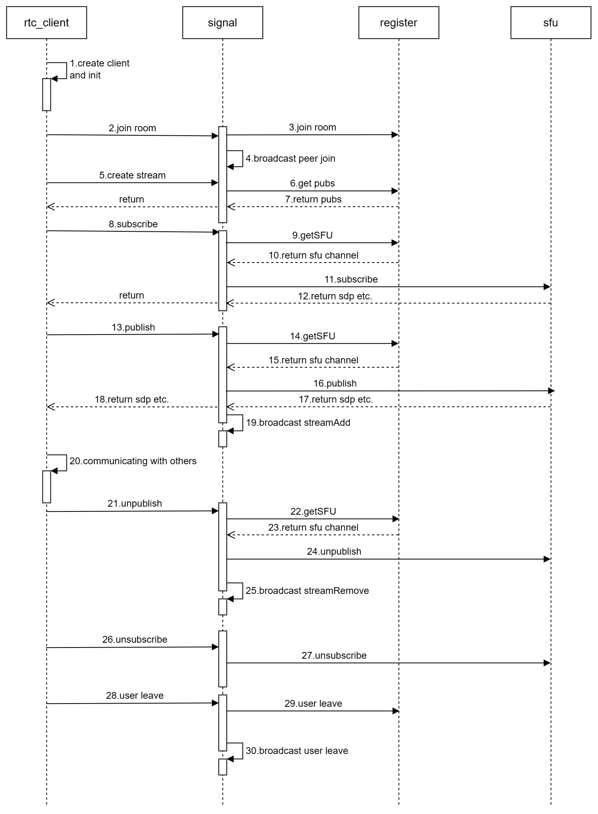
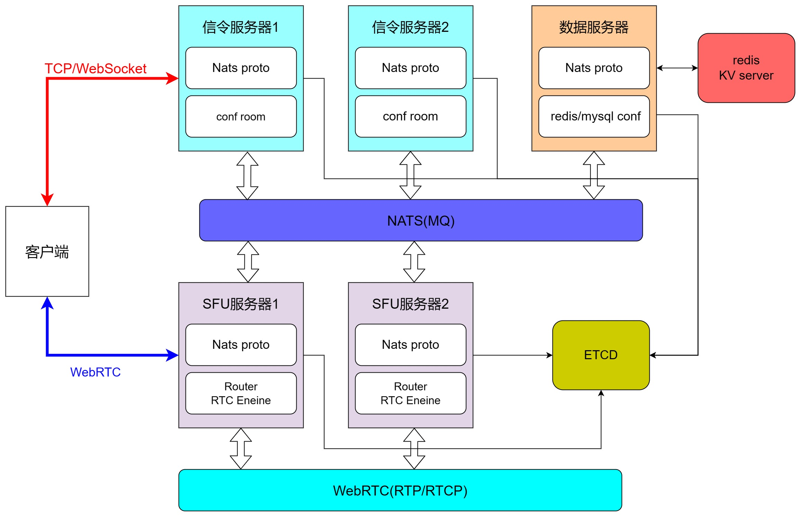
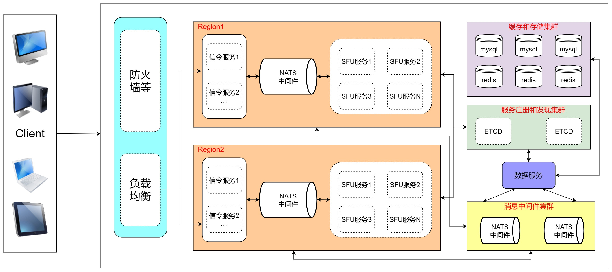

# 基于GO的分布式RTC Server

# 1. 介绍
- 基于Go语言编写的分布式web rtc的server；
- 基于SFU架构，音频支持opus，视频支持vp8；
- 基于etcd构建的分布式服务端，支持服务注册和服务发现；
- 使用logus搭建的日志系统，并支持将日志写入kafka，供elk消费；
- 增加opus立体声支持，并支持录音保存到ogg文件；
- 信令、媒体服务器等独立部署，通过gpc进行交互，协议采用proto格式设计。

# 2.组件
| 名称          | 版本      | 说明                                                    |
|-------------|---------|-------------------------------------------------------|
| go          | v1.18   |
| go-redis    | v6.15.9 | redis组件
| logus       | v1.9.0  | 日志组件 
| go-protoo   | v7.40.0 | [信令框架](https://github.com/cloudwebrtc/go-protoo)    
| nats.go     | v1.13.1 | [消息中间件组件](https://github.com/cloudwebrtc/nats-protoo/blob/master/doc/protocol.md)   
| viper       | v1.15.0 | [config组件](https://github.com/spf13/viper)  
| etcd/client | v3.5.7  | etcd组件   
| pion/webrtc | v2.2.26 | webrtc组件   
| grpc        | v1.52.0 | grpc
# 3. 流程图
<br>
<center>流程图 (by 飞书文档)</center>

# 4. 结构图和架构

<br>
<center>结构图 (by 飞书文档)</center>

<br>
<center>架构 (by 飞书文档)</center>

# 5. 通信协议
- 协议采用[protoo](https://protoo.versatica.com/)格式设计，利用websocket进行连接，数据采用json格式

> C = client <br>
> S = server <br>
> uid = 用户id <br>
> rid = 房间id <br>
> mid = 用户发布的流id <br>
> sid = 用户订阅的流id <br>
> signalid = 用户所在的信令服务器id <br>
> sfuid = 用户所在的sfu服务器id <br>
### websocket连接
- C-->S
ws://$host:$port/ws?peer=$uid

### 加入房间
- C-->S
```json
{
    "request":true,
    "id":124495,
    "method":"join",
    "data":{
        "rid":"rid_772"
    }
}
```
- S-->C

加入成功
```json
{
    "response":true,
    "id":124495,
    "ok":true,
    "data":{
      "pubs":[
        {
          "mid":"xxx_12445",
          "minfo":{
          "audio":true,
          "audiotype":0,
          "video":false,
          "videotype":0
        },
        "rid":"rid_772",
        "sfuid":"sz_sfu_1",
        "uid":"xxx_111s"
      }
    ],
    "users":[
      {
        "signalid":"sz_signal_1",
        "rid":"rid_772",
        "uid":"xxx_111s"
      }
    ]
  }
}
```
加入失败
```json
{
	"response":true,
	"id":124495,
	"ok":false,
	"errorCode": "err_codexxx",
	"errorReason": "err_reason"
}
```
### 离开房间
- C-->S
```json
{
	"request":true,
	"id":21244546,
	"method":"leave",
	"data":{
		"rid":"rid_772"
	}
}
```
- S-->C
    
成功
```json
{
	"response":true,
	"id":21244546,
	"ok":true,
	"data":{}
}
```
失败
```json
{
	"response":true,
	"id":21244546,
	"ok":false,
	"errorCode": "err_codexxx",
	"errorReason": "error_reason"
}
```
### 房间内发送心跳信息
- C-->S
```json
{
	"request":true,
	"id":21244546,
	"method":"keepalive",
	"data":{
		"rid":"rid_2323"
	}
}
```
- S-->C

发送成功
```json
{
	"response":true,
	"id":21244546,
	"ok":true,
	"data":{}
}
```
发送失败
```json
{
	"response":true,
	"id":21244546,
	"ok":false, 
    "errorCode": "err_codexxx",
    "errorReason": "error_reason"
}

```
### 发布流
- C-->S
```json
{
	"request":true,
	"id":21244546,
	"method":"publish",
	"data":{
		"rid":"rid_2323",
		"jsep":{"type":"offer","sdp":"..."},
		"minfo":{
			"audio":true,
			"video":true,
			"audiotype":0,
			"videotype":0
		}
	}
}
```
- S-->C

发布成功
```json
{
	"response":true,
	"id":21244546,
	"ok":true,
	"data":{
		"jsep":{
			"sdp":"$sdp",
			"type":"answer"
		},
		"mid":"midea_10d#1047",
		"sfuid":"sz_sfu_1"
	}
}
```
发布失败
```json
{
	"response":true,
	"id":21244546,
	"ok":false,
    "errorCode": "err_codexxx",
    "errorReason": "error_reason"
}
```
### 取消发布流
- C-->S
```json
{
	"request":true,
	"id":21244546,
	"method":"unpublish",
	"data":{
		"rid":"rid_2323",
		"mid":"midea_10d#1047",
		"sfuid":"sz_sfu_1"
	}
}
```
- S-->C

取消发布成功
```json
{
	"response":true,
	"id":21244546,
	"ok":true,
	"data":{}
}
```
取消发布失败
```json
{
	"response":true,
	"id":21244546,
	"ok":false,
    "errorCode": "err_codexxx",
    "errorReason": "error_reason"
}
```
### 订阅流
- C-->S
```json
{
	"request":true,
	"id":21244546,
	"method":"subscribe",
	"data":{
		"rid":"rid_2323",
		"mid":"midea_10d#1047",
		"jsep":{
			"type":"offer",
			"sdp":"#sdp"
		},
		"sfuid":"sz-sfu-1"
	}
}
```
- S-->C

订阅成功
```json
{
	"response":true,
	"id":21244546,
	"ok":true,
	"data":{
		"jsep":{
			"sdp":"$sdp",
			"type":"answer"
		},
		"sid":"sid_146e#6732"
	}
}
```
订阅失败
```json
{
	"response":true,
	"id":21244546,
	"ok":false,
    "errorCode": "err_codexxx",
    "errorReason": "error_reason"
}
```
### 取消订阅流
- C-->S
```json
{
	"request":true,
    "id":21244546,
    "method":"unsubscribe",
    "data":{
		"rid": "rid_2323",
        "mid": "64236c21-4a3d-c767d1e1d67f#ABCDEF",
        "sid": "64236c21-4a3d-c767d1e1d67f#ABCDEF",
        "sfuid":"sz-sfu-1"
    }
}
```
- S-->C

取消订阅成功
```json
{
	"response":true,
	"id":21244546,
	"ok":true,
	"data":{}
}
```
取消订阅失败
```json
{
	"response":true,
	"id":21244546,
	"ok":false, 
    "errorCode": "err_codexxx",
    "errorReason": "error_reason"
}

```
### 发送广播
- C-->S
```json
{
	"request":true,
	"id":21244546,
	"method":"broadcast",
	"data":{
		"rid":"rid_2323",
		"data":"$data"
	}
}
```
- S-->C
成功
```json
{
	"response":true,
	"id":21244546,
	"ok":true,
	"data":{}
}
```
失败
```json
{
	"response":true,
	"id":21244546,
	"ok":false,
    "errorCode": "err_codexxx",
    "errorReason": "error_reason"
}
```
## server主动通知client
### 有人加入房间
```json
{
	"notification" : true,
	"method": "peer-join",
	"data":{
		"rid": "rid_2323",
		"uid": "64236c21-21e8-c767d1e1d67",
		"bizid": "biz"
	}
}
```
### 有人离开房间
```json
{
	"notification" : true,
	"method": "peer-leave",
	"data":{
		"rid": "rid_2323",
		"uid": "64236c21-21e8-c767d1e1d67"
	}
}

```
### 有人发布流
- C-->S
```json
{
	"notification" : true,
	"method":"stream-add",
	"data":{
		"rid": "rid_2323",
		"uid": "64236c21-21e8-c767d1e1d67",
		"mid": "64236c21-9f80-c767dd67f#ABCDEF",
		"sfuid":"sz-sfu-1",
		"minfo": {
			"audio":true,
			"video":true,
			"audiotype":0,
			"videotype":0
		}
	}
}
```

### 有人取消发布流
```json
{
	"notification" : true,
	"method":"stream-remove",
	"data":{
		"rid": "rid_2323",
		"uid": "64236c21-21e8-c767d1e1d67",
		"mid": "64236c21-9f80-c767dd67f#ABCDEF"
	}
}
```
### 有人发广播
- C-->S
```json
{
	"notification" : true,
	"method":"broadcast",
	"data":{
		"rid":"rid_2323",
		"uid": "64236c21-21e8-c767d1e1d67",
		"data":"$date"
	}
}


```
# 6.参考资料
[1]**信令框架go-protoo**:
https://blog.csdn.net/weixin_43966044/article/details/120808752,
https://protoo.versatica.com/

[2]**nats**: https://github.com/cloudwebrtc/nats-protoo/blob/master/doc/protocol.md